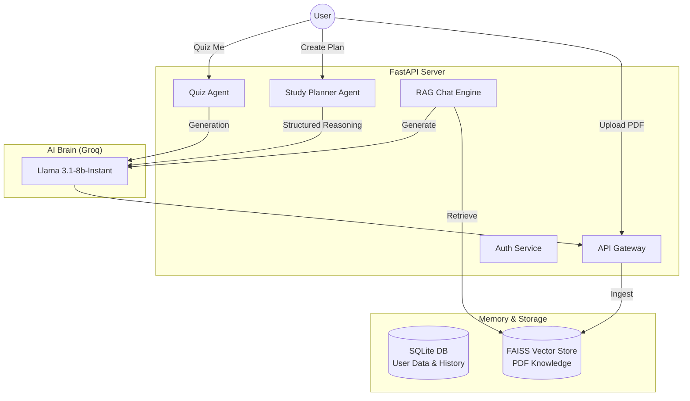

# 🎓 Agentic Learning Copilot

> **Transforming static PDFs into an interactive, personalized AI Tutor.**  
> *Built for the Agentic AI Hackathon 2026*


---

## 🚀 The Vision

Students and professionals are drowning in information. Textbooks, research papers, and lecture notes are static—they don't talk back, they don't plan for you, and they don't know when you're struggling.

**Agentic Learning Copilot** changes that. It isn't just a chatbot; it's an **autonomous study agent** that:
1.  **Ingests** your learning materials (PDFs).
2.  **Plans** a study schedule around your exam dates.
3.  **Teaches** you via Socratic dialogue (RAG).
4.  **Tests** your mastery with auto-generated quizzes.

## 🤖 What Makes it "Agentic"?

Unlike standard RAG apps that just answer questions, this system displays **agentic reasoning**:

*   **🧠 Structured Planning Agent**: It doesn't just summarize; it understands time constraints. Give it an exam date, and it logically breaks down the syllabus into a daily schedule using structured output generation.
*   **💾 Long-Term Memory**: It retains context across sessions using a hybrid memory architecture (SQL for structured progress, Vector Store for semantic knowledge).
*   **🎯 Active Assessment**: It proactively generates quizzes to verify knowledge, rather than passively waiting for user input.

---

## 🛠️ System Architecture



## ✨ Key Features

| Feature | Description | Tech Used |
| :--- | :--- | :--- |
| **📚 Document Ingestion** | Upload any PDF (textbooks, slides). The agent chunks and indexes it for semantic retrieval. | `PyMuPDF`, `FAISS`, `HuggingFace` |
| **🗓️ Smart Planner** | Tell the agent your exam date. It reads the syllabus and builds a day-by-day roadmap. | `LangChain Structured Output` |
| **💬 Contextual Chat** | Ask detailed questions. The agent cites sources from your specific document. | `Groq (Llama 3.1)`, `RAG` |
| **📝 Auto-Quizzing** | The agent dynamically creates multiple-choice questions to test your retention. | `Pydantic Models` |
| **🔒 Secure Profile** | Your learning data and documents are isolated and password-protected. | `OAuth2`, `JWT` |

---

## ⚡ Quick Start

### 1. Clone & Setup
```bash
git clone <your-repo-url>
cd hack
python -m venv venv
source venv/bin/activate  # Windows: venv\Scripts\activate
pip install -r requirements.txt
```

### 2. Configure Environment
Create a `.env` file in the root directory:
```env
GROQ_API_KEY=gsk_... (Get yours at console.groq.com)
```

### 3. Launch the Agent
```bash
uvicorn main:app --reload
```
*Access the interactive API UI at: `http://localhost:8000/docs`*

---

## 🎮 Demo Walkthrough

1.  **Sign Up**: Create a user (`POST /signup`).
2.  **Upload Knowledge**: Upload a biology textbook PDF (`POST /upload`).
3.  **Create a Strategy**: Call `POST /plan` with `"exam_date": "2026-02-01"`. Watch it generate a 20-day revision schedule covering all chapters.
4.  **Deep Dive**: Ask, *"Explain the Krebs cycle based on Chapter 4"* (`POST /chat`).
5.  **Test Yourself**: Request a quiz (`POST /quiz`) and get a structured JSON response with questions and answers.

---

## 🔮 Future Roadmap

*   **Multimodal Agents**: Analyzing diagrams and charts within PDFs.
*   **Voice Interface**: Real-time oral exams with the AI.
*   **Web Search Tool**: Letting the agent browse the web for updated information when the PDF is outdated.

---

*Made with ❤️ for the Agentic AI Hackathon 2026.*