# 🎓 Personalized-Learning-Copilot-for-Core-Courses

> **Transforming static PDFs into an interactive, personalized AI Tutor.**  
> *Built for the Agentic AI Hackathon 2026*


---

## 🚀 The Vision

Students and professionals are drowning in information. Textbooks, research papers, and lecture notes are static—they don't talk back, they don't plan for you, and they don't know when you're struggling.

**Agentic Learning Copilot** changes that. It isn't just a chatbot; it's an **autonomous study agent** that:
1.  **Ingests** your learning materials (PDFs).
2.  **Plans** a study schedule around your exam dates.
3.  **Teaches** you via Socratic dialogue (RAG).
4.  **Tests** your mastery with auto-generated quizzes.

## 🤖 What Makes it "Agentic"?

Unlike standard RAG apps that just answer questions, this system displays **agentic reasoning**:

*   **🧠 Structured Planning Agent**: It doesn't just summarize; it understands time constraints. Give it an exam date, and it logically breaks down the syllabus into a daily schedule using structured output generation.
*   **🔄 LangGraph Orchestration: The system doesn't just call APIs; it runs a Stateful Workflow. Using LangGraph, the Planner and Quizzer communicate through a shared "State." If the Quizzer detects low mastery, it can trigger a "Re-Planner" loop to automatically simplify upcoming tasks—true autonomous behavior.
*   **⚡ Ultra-Low Latency Memory (Redis): We use Redis as a high-speed Short-Term Memory layer. This allows the agent to recall the last 10 turns of a conversation in sub-milliseconds, ensuring fluid, human-like dialogue without redundant database hits.
*   **💾 Long-Term Memory**: It retains context across sessions using a hybrid memory architecture (SQL for structured progress, Vector Store for semantic knowledge).
*   **🎯 Active Assessment**: It proactively generates quizzes to verify knowledge, rather than passively waiting for user input.

---

## 🛠️ System Architecture

```mermaid
graph TD
    User((User))
    
    subgraph "Agent Orchestration (LangGraph)"
        Graph[StateGraph]
        Planner[Planner Agent]
        Quizzer[Quiz Agent]
        RePlan{Mastery Check}
        
        Graph --> Planner
        Planner --> Quizzer
        Quizzer --> RePlan
        RePlan -->|Score < 50| Planner
        RePlan -->|Score ≥ 50| END((Goal Achieved))
    end
    
    subgraph "Memory Layers"
        Redis[(Redis\nShort-Term Memory)]
        SQL[(SQLite\nLong-Term History)]
        Vector[(FAISS Vector Store\nCourse PDFs)]
    end
    
    User --> |Chat| Redis
    Redis --> |Context| Llama[Llama 3.1-8B via Groq]
    Llama --> |Update Memory| Redis
    Llama --> |Persist History| SQL
    
    User --> |Upload PDFs| Vector
    Graph --> |RAG Retrieval| Vector

```


## The system follows a closed-loop learning cycle:

Planner Agent Creates a personalized study plan based on user goals and syllabus.
Quiz Agent
Generates adaptive quizzes from course material using RAG.
Mastery Check

## Evaluates performance:
If score < 50 → Re-plan
If score ≥ 50 → Learning goal achieved

## Memory Layers:
Redis: short-term context
SQLite: long-term learning history
FAISS: vector search over PDFs

This enables reflection, adaptation, and personalization core to agentic AI.


## ✨ Key Features

| Feature | Description | Tech Used |
| :--- | :--- | :--- |
| **📚 Document Ingestion** | Upload any PDF (textbooks, slides). The agent chunks and indexes it for semantic retrieval. | `PyMuPDF`, `FAISS`, `HuggingFace` |
| **🗓️ Smart Planner** | Tell the agent your exam date. It reads the syllabus and builds a day-by-day roadmap. | `LangChain Structured Output` |
| **💬 Contextual Chat** | Ask detailed questions. The agent cites sources from your specific document. | `Groq (Llama 3.1)`, `RAG` |
| **📝 Auto-Quizzing** | The agent dynamically creates multiple-choice questions to test your retention. | `Pydantic Models` |
| **🔒 Secure Profile** | Your learning data and documents are isolated and password-protected. | `OAuth2`, `JWT` |
| **🧠 Multi-Agent State**| The Planner and Quizzer share a "Blackboard" state to stay in sync.  | `LangGraph` |
| **🚀 Instant Recall**|	Chat history is retrieved from an in-memory cache for zero-lag conversations.|`Redis`|

---

## ⚡ Quick Start

### 1. Clone & Setup
```bash
git clone 
cd hack
python -m venv venv
source venv/bin/activate  # Windows: venv\Scripts\activate
pip install -r requirements.txt
```

### 2. Configure Environment
Create a `.env` file in the root directory:
```env
GROQ_API_KEY=gsk_... (Get yours at console.groq.com)
```

### 3. Launch the Agent
```bash
uvicorn main:app --reload
```
*Access the interactive API UI at: `http://localhost:8000/docs`*

---

## 🎮 Demo Walkthrough

1.  **Sign Up**: Create a user (`POST /signup`).
2.  **Upload Knowledge**: Upload a biology textbook PDF (`POST /upload`).
3.  **Create a Strategy**: Call `POST /plan` with `"exam_date": "2026-02-01"`. Watch it generate a 20-day revision schedule covering all chapters.
4.  **Deep Dive**: Ask, *"Explain the Krebs cycle based on Chapter 4"* (`POST /chat`).
5.  **Test Yourself**: Request a quiz (`POST /quiz`) and get a structured JSON response with questions and answers.


---

*Made with ❤️ for the Agentic AI Hackathon 2026.*
